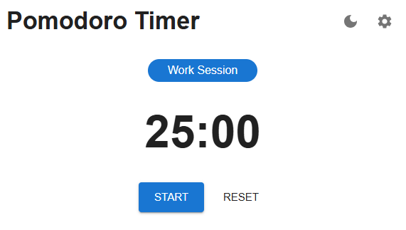
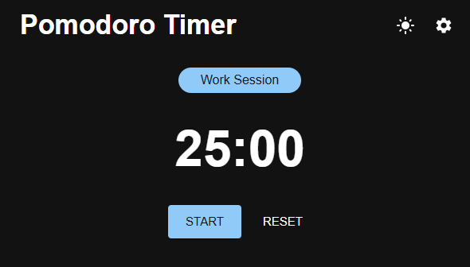

# ⏱️ Pomodoro Timer — React + MUI

A clean, modern, and fully customizable Pomodoro Timer built with **React**, **Material UI**, and a modular architecture designed for scalability.  
This project includes session tracking, sound notifications, mobile vibration, dark mode, and a polished UI with smooth animations.

---

## 🚀 Features

-   **Pomodoro workflow**
    -   Work sessions
    -   Short breaks
    -   Long breaks every 4 cycles
-   **Fully configurable durations**
    -   Work / Short Break / Long Break
-   **Dark Mode toggle**
    -   Persistent theme stored in `localStorage`
-   **Sound notification** when a session ends
-   **Mobile vibration** pattern for session transitions
-   **Browser notifications** (with permission handling)
-   **Smooth animations** using Framer Motion
-   **Clean modular architecture**
    -   `usePomodoro` hook for timer logic
    -   Context providers for state management
    -   Reusable UI components

---

## 🧩 Tech Stack

-   **React 18**
-   **Material UI (MUI)**
-   **Framer Motion**
-   **Vite**
-   **Custom React Hooks**
-   **Context API**

---

## 📦 Installation

Clone the repository:

```bash
git clone https://github.com/your-username/pomodoro-timer.git
cd pomodoro-timer
```

Install dependencies:

```bash
npm install
```

---

## 🗂️ Project Structure

```plaintext
src/
  components/
    Controls.jsx
    TimerDisplay.jsx
    SessionTypeLabel.jsx
    SettingsDialog.jsx
  context/
    PomodoroProvider.jsx
    ThemeProvider.jsx
  hooks/
    usePomodoro.js
  assets/
    sounds/
      ding.mp3
      beep.mp3
  App.jsx
  main.jsx
public/
  sounds/
    ding.mp3
    beep.mp3
```

---

## 🎛️ Configuration

Users can customize:

-   Work duration
-   Short break duration
-   Long break duration
    All settings are stored in localStorage and restored on reload.

---

## 🔔 Notifications & Feedback

The app provides multiple feedback channels:

-   **Sound alert** at the end of each session
-   **Vibration pattern** on supported mobile devices
-   **Browser notifications** (if permission is granted)

---

## 🌙 Dark Mode

A global theme provider manages light/dark mode using MUI’s theming system.
The theme is persisted automatically and restored on reload.

---

## 🧠 Architecture Overview

usePomodoro.js
Encapsulates all timer logic:

-   Countdown mechanism
-   Session transitions
-   Long-break cycle logic
-   Notifications, sound, vibration
-   Cleanup and interval management

PomodoroProvider.jsx
Exposes:

-   Timer state
-   Config state
-   Timer controls (start, stop, reset)

ThemeProvider.jsx
Handles:

-   Light/dark mode
-   Theme persistence
-   MUI theme creation

---

## 🖼️ Screenshots




---

## 🛠️ Future Improvement

-   Weekly productivity statistics
-   Custom sound selection
-   Multi-language support
-   PWA support for offline usage
-   Keyboard shortcuts

---

## 📄 License

MIT License.
Feel free to use, modify, and distribute.

---

## 👨‍💻 Author

Built with care by Alex.
Focused on clean architecture, modular design, and premium UI polish.

---

# Want me to generate a **Spanish version** too, or a **GitHub‑optimized version with badges**?
